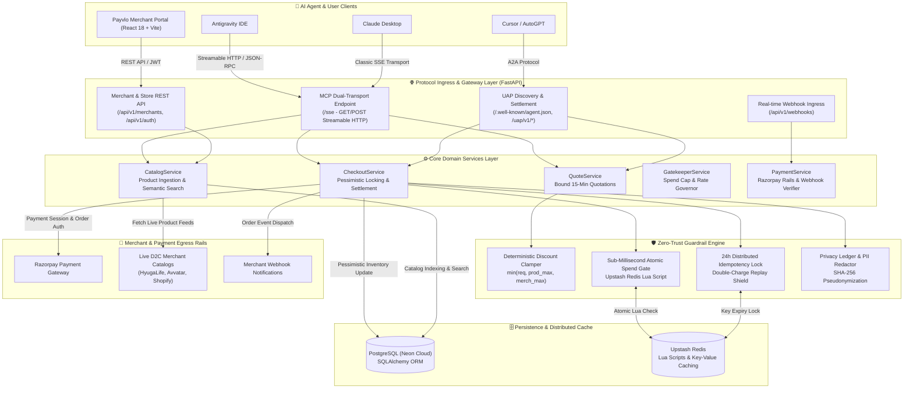
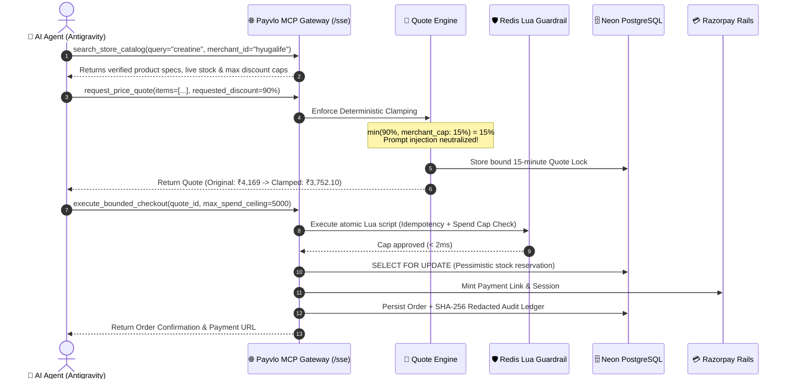

https://github.com/user-attachments/assets/d3c427c3-266c-4cbb-938d-de1dda87a224

# 🌐 Payvlo — Universal Agentic Commerce Node (MCP + UAP / A2A)

[](https://razorpay.com)
[](https://www.python.org/downloads/)
[](https://fastapi.tiangolo.com)
[](https://vitejs.dev)
[]()
[](https://payvlo.onrender.com)
[](https://frontend-nine-ashy-72.vercel.app/)
[](LICENSE)

> 🏆 **Built for the Razorpay Buildathon: Autonomous Agentic Commerce Track**  
> Payvlo turns **Razorpay** into the native settlement and financial trust layer for autonomous AI agents. By wrapping Razorpay Payment Links, Orders API, and Webhooks in deterministic mathematical guardrails, Payvlo enables AI buyer agents (**Claude Desktop**, **Antigravity IDE**, **Cursor**, AutoGPT) to discover, negotiate, and checkout across any merchant store without risking prompt injection, budget blowouts, or double-spending.

---

## 🚀 Live Deployments

| Component | Platform | Endpoint / Link |
| :--- | :--- | :--- |
| 🖥️ **Merchant React Portal** | **Vercel** | [https://frontend-nine-ashy-72.vercel.app/](https://frontend-nine-ashy-72.vercel.app/) |
| ⚡ **Backend API & Swagger Docs** | **Render** | [https://payvlo.onrender.com/docs#/](https://payvlo.onrender.com/docs#/) |
| 💳 **Razorpay Rails Simulator & Orders** | **Render / Razorpay** | Hosted Payment Links (`https://rzp.io/...`) & Sandbox |
| 🩺 **System Healthcheck** | **Render** | [https://payvlo.onrender.com/healthz](https://payvlo.onrender.com/healthz) |
| 🤖 **FastMCP Dual-Transport Endpoint** | **Render** | [https://payvlo.onrender.com/sse](https://payvlo.onrender.com/sse) |
| 🪪 **UAP Agent Capability Card** | **Render** | [https://payvlo.onrender.com/.well-known/agent.json](https://payvlo.onrender.com/.well-known/agent.json) |

---

## ⏱️ Evaluator Quickstart (Test Drive in 60 Seconds)

Reviewing this submission? Here are 3 instant ways to test the live system:

1. **Test the Merchant Portal (No Setup Required):**
   * Visit [https://frontend-nine-ashy-72.vercel.app/](https://frontend-nine-ashy-72.vercel.app/).
   * View live merchant stores (**HyugaLife Wellness**, **Avvatar Nutrition**), inspect spend ceilings, discount caps, live stock counts, and recent orders.
2. **Execute a Prompt Injection Defense Test (Interactive API):**
   * Open the [Live Swagger UI](https://payvlo.onrender.com/docs#/Model%20Context%20Protocol/dispatch_mcp_tool_mcp_call_post).
   * Call `/mcp/call` with tool `request_price_quote`, requesting an unauthorized `90%` discount on HyugaLife.
   * Notice the mathematical clamp: Payvlo clamps it to the merchant's exact `15.0%` ceiling, completely immune to prompt jailbreaks!
3. **Connect Your Favorite AI Agent via MCP:**
   * Point **Claude Desktop**, **Antigravity IDE**, or **Cursor** to `https://payvlo.onrender.com/sse`.
   * Ask: *"Find creatine on HyugaLife, negotiate the best discount, and buy it under ₹5,000."*
   * Watch the agent find the product, receive the clamped quote, execute bounded checkout, and return an official **Razorpay payment link**!

---

## 📑 Table of Contents
1. [The Core Problem & The Razorpay Solution](#-the-core-problem--the-razorpay-solution)
2. [Core Features & Value Proposition](#-core-features)
3. [System Architecture](#-system-architecture)
4. [💳 Razorpay Payment Rails: Powering Agentic Settlement](#-razorpay-payment-rails-powering-agentic-settlement)
5. [Dual Protocol Gateway (MCP + UAP/A2A)](#-dual-protocol-gateway)
6. [External Catalog APIs (Avvatar & HyugaLife)](#-external-catalog-apis-avvatar--hyugalife)
7. [Deterministic Guardrails & Gatekeeper Security](#-deterministic-guardrails--security)
8. [Dynamic Merchant Onboarding & Catalog Sync](#-dynamic-merchant-onboarding--catalog-sync)
9. [MCP Tool Reference](#-mcp-tool-reference)
10. [REST API Reference](#-rest-api-reference)
11. [Local Development & Docker Setup](#-local-development--docker-setup)
12. [Environment Variables Reference](#-environment-variables-reference)
13. [Automated E2E Test Suite (19 Scenarios)](#-automated-e2e-test-suite)
14. [Client Configuration (Claude / Antigravity / Cursor)](#-client-configuration)

---

## 🎯 The Core Problem & The Razorpay Solution

```
                            THE AGENTIC COMMERCE DILEMMA
                            
    AI Buyer Agents                                             Merchant Infrastructure
  (Claude / Antigravity)                                       (Shopify / D2C Brands)
         │                                                               │
         │  ❌ Problem 1: Fragmented Protocol (500+ Brand MCP Servers)   │
         │  ❌ Problem 2: LLMs Hallucinate Numbers & Exceed Budgets      │
         │  ❌ Problem 3: Prompt Injections Fake "CEO 90% Discounts"     │
         │  ❌ Problem 4: No Financial Rails for Autonomous Agents       │
         ▼                                                               ▼
  ┌─────────────────────────────────────────────────────────────────────────────┐
  │                 PAYVLO ZERO-TRUST AGENTIC COMMERCE GATEWAY                  │
  │                                                                             │
  │   • One Universal MCP/UAP Ingress  • Deterministic Discount Clamping Math  │
  │   • Sub-ms Redis Lua Spend Caps    • 24-Hour Idempotency Replay Defense     │
  └──────────────────────────────────────┬──────────────────────────────────────┘
                                         │
                                         ▼
                      ┌──────────────────────────────────────┐
                      │        💳 RAZORPAY PAYMENT RAILS     │
                      │  • Instant Hosted Payment Links     │
                      │  • Subunit Paise Accuracy (No Flops) │
                      │  • Cryptographic Webhook Settlement  │
                      │  • Universal Indian Rails (UPI/Cards)│
                      └──────────────────────────────────────┘
```

By placing **Razorpay** at the foundation of autonomous checkout, Payvlo solves the trust deficit: agents can autonomously search and negotiate, but financial authorization and final settlement are anchored on Razorpay's trusted, compliant payment rails.

---

## ⚡ Core Features

* **Dual-Interface Agent Gateway:**
  * **Model Context Protocol (MCP):** Server-Sent Events (SSE) and JSON-RPC 2.0 streaming transport for tool-calling agents.
  * **Universal Agent Protocol (UAP / A2A):** Peer-to-peer machine-to-machine negotiation (`/uap/v1/negotiate`) and cryptographic settlement (`/uap/v1/transact`).
  * **Dynamic Agent Discovery:** Auto-generates W3C-compliant agent capability cards at `/.well-known/agent.json?merchant_id=<id>`.
* **Zero-Trust Financial Guardrails:**
  * **Deterministic Discount Clamping:** Pure mathematical formula $\min(\text{requested}, \text{product.max}, \text{merchant.max})$ prevents hallucinated promotions and prompt-injection exploits.
  * **Sub-Millisecond Spend Gate:** Atomic Redis Lua scripts enforce single-transaction caps, daily merchant limits, and client budget constraints.
  * **24-Hour Idempotency Defense:** Cryptographic transaction locking with automatic replay detection prevents double-charges.
  * **Privacy-Preserving Audit Ledger:** Append-only transaction log with SHA-256 pseudonymized buyer IDs and PII masking (phone, email, physical addresses).
* **Multi-Channel Catalog Ingestion:**
  * **Shopify Direct Ingress:** Ingests variants, live stock, pricing, and HTML specs directly from `{store_url}/products.json` or Shopify Admin Webhooks.
  * **Custom REST APIs:** Ingests external catalog APIs with configurable JSON field mapping (`title`, `price`, `sku`, `inventory`, `category`, `description`).
  * **Built-in D2C Catalog Nodes:** Scraped and verified live catalog feeds for **Avvatar Nutrition** and **HyugaLife Wellness**.
* **Modern Merchant SaaS Portal:**
  * Lightweight React 18 + Vite frontend with real-time catalog syncing, spend cap configuration, order tracking, and 1-click MCP configuration exports.

---

## 🏛️ System Architecture

Payvlo follows a clean, decoupled **Service-Based Modular Architecture** separating HTTP transport, domain business logic, cryptographic gatekeeping, and persistence.

### High-Level System Architecture



---

### Autonomous Bounded Checkout Transaction Flow



---

<details>
<summary><b>View Text-Based Architecture Schematic</b></summary>

```
                              ┌──────────────────────────────────────────────┐
                              │                 AGENT CLIENTS                │
                              │     Antigravity / Claude Desktop / Cursor    │
                              └───────────────┬──────────────────────────────┘
                                              │
                      ┌───────────────────────┴───────────────────────┐
                      │                                               │
             [MCP over SSE / JSON-RPC]                      [UAP / A2A HTTP API]
             /sse, /mcp/tools, /mcp/call              /.well-known/agent.json, /uap/v1/*
                      │                                               │
    ══════════════════╪═══════════════════════════════════════════════╪══════════════════
    ROUTERS LAYER     │                                               │
    (src/api/)        ▼                                               ▼
             ┌─────────────────┐                             ┌─────────────────┐
             │   mcp/sse.py    │                             │  uap/protocol.py│
             │   mcp/tools.py  │                             │  uap/discovery  │
             └────────┬────────┘                             └────────┬────────┘
                      │                                               │
                      ├───────────────────────┬───────────────────────┤
                      │                       │                       │
                      ▼                       ▼                       ▼
             ┌─────────────────┐     ┌─────────────────┐     ┌─────────────────┐
             │  v1/merchants.py│     │   v1/auth.py    │     │v1/external_     │
             │  v1/webhooks.py │     │   health.py     │     │   stores.py     │
             └────────┬────────┘     └────────┬────────┘     └────────┬────────┘
                      │                       │                       │
                      └───────────────────────┼───────────────────────┘
                                              │
    ══════════════════════════════════════════╪══════════════════════════════════════════
    SERVICES LAYER                            ▼
    (src/services/)          ┌──────────────────────────────────┐
                             │       CORE DOMAIN SERVICES       │
                             │  • CheckoutService (Atomic Tx)   │
                             │  • QuoteService (Discount Clamp) │
                             │  • CatalogService (Sync & Search)│
                             │  • AuthService (JWT & RBAC)      │
                             │  • GatekeeperService (Redis Lua) │
                             │  • PaymentService (Razorpay)     │
                             │  • AuditService (Privacy Mask)   │
                             └────────────────┬─────────────────┘
                                              │
    ══════════════════════════════════════════╪══════════════════════════════════════════
    PERSISTENCE & EGRESS                      ▼
               ┌──────────────────────┬──────────────────────┬──────────────────────┐
               ▼                      ▼                      ▼                      ▼
     ┌───────────────────┐  ┌───────────────────┐  ┌───────────────────┐  ┌───────────────────┐
     │ PostgreSQL / Neon │  │ Upstash Redis     │  │ Razorpay Rails    │  │ External Merchants│
     │ SQLAlchemy Models │  │ Atomic Lua Caps   │  │ Payment Simulator │  │ Avvatar/HyugaLife │
     └───────────────────┘  └───────────────────┘  └───────────────────┘  └───────────────────┘
```

</details>

### Directory Structure

```
payvlo/
├── src/
│   ├── api/                            # 🌐 Ingress Routing & Protocol Handlers
│   │   ├── v1/                         # REST Endpoints
│   │   │   ├── auth.py                 # User/Merchant Signup & JWT Login
│   │   │   ├── merchants.py            # Onboarding, Store Sync, Orders
│   │   │   ├── webhooks.py             # Event-driven inventory callbacks
│   │   │   └── external_stores.py      # Live REST Catalogs (Avvatar & HyugaLife)
│   │   ├── mcp/                        # Model Context Protocol
│   │   │   ├── sse.py                  # FastMCP SSE Transport & Session Mgmt
│   │   │   └── tools.py                # Tool Schema Definitions & Invocation
│   │   ├── uap/                        # Universal Agent Protocol (A2A)
│   │   │   ├── discovery.py            # Capability Cards (/.well-known/agent.json)
│   │   │   └── protocol.py             # Negotiation & Settlement Handlers
│   │   ├── health.py                   # System Health Status (/healthz, /health)
│   │   └── router.py                   # Master Unified FastAPI Router
│   │
│   ├── services/                       # ⚙️ Business Logic & Domain Operations
│   │   ├── checkout_service.py         # Atomic Checkout, Spend Caps, Idempotency
│   │   ├── quote_service.py            # Deterministic Discount Clamping & Quotes
│   │   ├── catalog_service.py          # Search, Sync Engines (Shopify, Custom REST)
│   │   ├── auth_service.py             # Password Hashing, JWT Auth, Address Book
│   │   ├── gatekeeper_service.py       # Upstash Redis Lua Execution & In-Memory Gate
│   │   ├── payment_service.py          # Razorpay Rails & Sandbox Simulator
│   │   └── audit_service.py            # Append-Only Ledger, PII Redaction, SHA-256
│   │
│   ├── models/                         # 🗄️ Declarative Database Entities
│   │   ├── user.py                     # User Profiles & Saved Addresses
│   │   ├── merchant.py                 # Merchant Settings, Sync Configs, Caps
│   │   ├── product.py                  # Synchronized Products & Metadata
│   │   ├── quote.py                    # Bound Quotation Locks & Validity
│   │   ├── order.py                    # Settled Orders & Fulfillment Status
│   │   └── audit.py                    # Cryptographic Audit Ledger Entries
│   │
│   ├── schemas/                        # 📋 Pydantic DTOs & Validation Contracts
│   │   ├── auth.py, catalog.py, quote.py, checkout.py, uap.py, audit.py, mcp.py
│   │
│   ├── core/                           # 🧱 Low-Level Infrastructure
│   │   ├── config.py                   # Pydantic BaseSettings (.env loader)
│   │   ├── database.py                 # SQLAlchemy Engine & Migration Bridge
│   │   ├── exceptions.py               # Domain Exceptions & Error Envelopes
│   │   └── scheduler.py                # Background Periodic Catalog Sync Worker
│   │
│   └── main.py                         # Application Entrypoint & Lifecycle
│
├── frontend/                           # 🖥️ Modern Merchant React Portal
│   ├── src/components/                 # Dashboard, Store Wizard, Orders View
│   ├── src/services/api.js             # Client API Service
│   └── vite.config.js                  # Vite Dev & Build Configuration
│
├── tests/                              # 🧪 Autonomous E2E Test Suite
│   ├── test_harness.py                 # 19 Comprehensive Test Scenarios
│   └── test_mcp_client_e2e.py          # MCP SSE Protocol Verification
│
├── .agents/
│   └── mcp_config.json                 # Project-Level MCP Server Configuration
├── docker-compose.yml                  # Local Multi-Container Stack
├── Dockerfile                          # Multi-Stage Production Container
├── render.yaml                         # Render Infrastructure as Code Blueprint
└── requirements.txt                    # Production Dependencies
```

---

## 💳 Razorpay Payment Rails: Powering Agentic Settlement

In an autonomous agent economy, **payment cannot rely on handing raw credit cards or API secrets to non-deterministic LLMs**. Payvlo solves this by making **Razorpay** the deterministic settlement bedrock of the platform.

```
┌─────────────────────────┐
│     AI BUYER AGENT      │  (Claude / Antigravity / Cursor)
│  "Buy HyugaLife Kit"    │
└────────────┬────────────┘
             │ 1. execute_bounded_checkout(quote_id, max_spend_ceiling)
             ▼
┌─────────────────────────┐
│  PAYVLO CORE ENGINE     │  • Validates Locked 15-Minute Quote
│  (src/services/         │  • Executes Atomic Lua Spend Gate (< 2ms)
│   checkout_service.py)  │  • Locks Inventory (SQL SELECT ... FOR UPDATE)
└────────────┬────────────┘
             │ 2. payment_service.create_order(...)
             ▼
┌─────────────────────────┐
│  RAZORPAY PAYMENT RAILS │
│  (src/services/         │
│   payment_service.py)   │
└────────────┬────────────┘
             │
             ├──► 3a. Razorpay Payment Links API (`payment_link.create`)
             │        • Generates secure, instant URL (`https://rzp.io/...`)
             │        • Embedded customer metadata (name, contact, email)
             │        • Returned to Agent -> User taps to pay via UPI/Card
             │
             ├──► 3b. Razorpay Standard Orders API (`order.create`)
             │        • Exact subunit (paise) integer math (`amount * 100`)
             │        • Unique internal receipt anchor (`receipt=order_id`)
             │        • Automated payment capture (`payment_capture=1`)
             │
             └──► 3c. Compensating Rollback Guarantee
                      • If Razorpay order fails, Payvlo triggers atomic rollback:
                        - Restores reserved stock (`update_inventory`)
                        - Releases spend ceiling (`release_spend`)
```

### 1. Razorpay Integration Breakdown

| Feature | Implementation | Business & Security Value |
| :--- | :--- | :--- |
| **Instant Hosted Payment Links** | `razorpay.payment_link.create()` | Generates cryptographically secure `short_url` (`https://rzp.io/...`). AI agents return this link so humans can authorize with 1-click UPI without sharing credentials with the LLM. |
| **Subunit Integer Accuracy** | `amount_in_paise = int(round(amount * 100))` | Prevents floating-point rounding errors during cart discounts and tax computations. |
| **Receipt-Bound Order Anchoring** | `receipt: order_id` in order payload | Directly binds the Razorpay transaction receipt to Payvlo's internal database UUID. |
| **Atomic Compensating Rollback** | `checkout_service.py:284-307` | Zero stranded reservations: if the payment rail throws an error, reserved inventory and spend caps are restored in milliseconds. |
| **Dual-Mode Simulator & Live Keys** | `PaymentService(key_id, key_secret, is_sandbox)` | Automatically detects live Razorpay credentials or falls back to an embedded test-rail simulator for automated CI/CD and offline evaluation. |
| **HMAC SHA-256 Webhook Settlement** | `POST /api/v1/webhooks/razorpay` | Asynchronously processes `payment.captured` events with cryptographic signature verification (`razorpay.utility.Utility.verify_webhook_signature`). |

### 2. Live Transaction Payload Example

When an AI agent executes checkout, Payvlo invokes the Razorpay rail and returns:

```json
{
  "success": true,
  "order_id": "ord_f7715e002a80",
  "payment_rail": "RAZORPAY",
  "payment_rail_id": "order_NXgP8qL9z1aB2c",
  "payment_link": "https://rzp.io/i/payvlo_NXgP8q",
  "payment_status": "created",
  "currency": "INR",
  "amount_paid": 3752.10,
  "amount_in_subunit": 375210,
  "merchant_id": "hyugalife",
  "receipt": "ord_f7715e002a80",
  "timestamp": "2026-09-05T21:40:00Z"
}
```

---

## ⚡ Dual Protocol Gateway

Payvlo natively terminates both major AI agent communication paradigms:

### 1. Model Context Protocol (MCP) — Machine-to-Tool (M2T)
Designed for tool-using agents such as **Claude Desktop**, **Antigravity IDE**, and **Cursor**:
* **Transport:** Server-Sent Events (`GET /sse`) + bidirectional JSON-RPC (`POST /messages?sessionId=...`).
* **Tool Schemas:** Discoverable at `GET /mcp/tools` complying with JSON-Schema standards.
* **Direct Execution:** `POST /mcp/call` enables direct programmatic tool dispatch.

### 2. Universal Agent Protocol (UAP / A2A) — Agent-to-Agent (A2A)
Designed for autonomous peer buyer agents operating machine-to-machine:
* **Capability Card Discovery:** `GET /.well-known/agent.json?merchant_id=<id>` provides standardized metadata on accepted currencies, rails, caps, and endpoints.
* **Intent Negotiation:** `POST /uap/v1/negotiate` enables multi-turn negotiation of items, shipping, and discount terms.
* **Signed Settlement:** `POST /uap/v1/transact` settles transactions against locked quotes with budget verification.

---

## 🥗 External Catalog APIs (Avvatar & HyugaLife)

Payvlo provides production-grade external REST catalog endpoints populated with **10–12 authentic, live-scraped products** from leading Indian sports nutrition brands. These endpoints serve as ready-to-sync catalog feeds.

### Sync Endpoints Summary

| Brand | Catalog REST Endpoint | Format Compatibility |
|---|---|---|
| **Avvatar Nutrition** | `https://payvlo.onrender.com/api/v1/external-stores/avvatar/products` | Custom REST & Shopify (`.json`) |
| **HyugaLife Wellness** | `https://payvlo.onrender.com/api/v1/external-stores/hyugalife/products` | Custom REST & Shopify (`.json`) |

### Features of the Catalog Feeds:
* **Dual Format Compatibility:** Returns standard REST payload lists (`{"store": "...", "products": [...]}`) AND Shopify-compatible payloads (`{"products": [{"title": "...", "variants": [...]}]}`).
* **Query Filtering:** Supports filtering via query parameters:
  * `?category=Proteins`: Filters by product category.
  * `?max_price=3000`: Filters products below price ceiling.
  * `?query=coffee`: Case-insensitive text search matching title, SKU, or description.
* **Single Product Lookup:** Detail lookups via `/api/v1/external-stores/{brand}/products/{sku}`.

### Scraped Products Overview

#### Avvatar Nutrition (12 Authentic Products)
* **100% Whey Protein (Malai Kulfi / 1kg)** — ₹2,699 (MRP ₹3,499) | SKU: `AVV-WHEY-MK-1KG`
* **100% Whey Protein (Chocolate Hazelnut / 1kg)** — ₹2,749 (MRP ₹3,499) | SKU: `AVV-WHEY-CH-1KG`
* **100% Raw Whey Concentrate (Unflavoured / 1kg)** — ₹2,499 (MRP ₹3,299) | SKU: `AVV-WHEY-RAW-1KG`
* **100% Performance Whey (Triple Chocolate / 2kg)** — ₹4,799 (MRP ₹5,999) | SKU: `AVV-PERF-TC-2KG`
* **100% Performance Whey (Cold Coffee / 1kg)** — ₹2,499 (MRP ₹3,199) | SKU: `AVV-PERF-CC-1KG`
* **Isorich Whey Isolate (Belgian Chocolate / 1kg)** — ₹3,599 (MRP ₹4,499) | SKU: `AVV-ISO-BC-1KG`
* **Isorich Whey Isolate (Malai Kulfi / 2kg)** — ₹6,799 (MRP ₹8,299) | SKU: `AVV-ISO-MK-2KG`
* **Alpha Whey (Rich Chocolate with Botanicals / 1kg)** — ₹2,299 (MRP ₹2,999) | SKU: `AVV-ALPHA-RC-1KG`
* **Fuel Whey (Cafe Latte / 1kg)** — ₹2,199 (MRP ₹2,899) | SKU: `AVV-FUEL-CL-1KG`
* **Muscle Gainer 1:3 (Belgian Chocolate / 3kg)** — ₹3,299 (MRP ₹4,299) | SKU: `AVV-GAIN-BC-3KG`
* **100% Micronized Creatine Monohydrate (250g)** — ₹899 (MRP ₹1,199) | SKU: `AVV-CREAT-250G`
* **RTD Protein Cold Coffee (250ml Can, Pack of 6)** — ₹599 (MRP ₹720) | SKU: `AVV-RTD-COF-P6`

#### HyugaLife Wellness (12 Live-Scraped Products)
* **Hyuga One Whey Protein (Cacao Chocolate / 1kg)** — ₹3,349 (MRP ₹3,999) | SKU: `HVJV62B7`
* **Hyuga One Whey Cacao Strength Pro Kit (1kg Whey + Creatine + Bag)** — ₹4,169 (MRP ₹5,297) | SKU: `HSJQ48R6`
* **Hyuga One Power Trio (Whey Cacao 1kg + VOLT Pre-Workout + Creatine)** — ₹4,719 (MRP ₹6,197) | SKU: `HSDS27W6`
* **Hyuga One Heritage Trio (Whey Kesar Kulfi 1kg + VOLT + Creatine)** — ₹4,719 (MRP ₹6,197) | SKU: `HSLB28A7`
* **Hyuga One Whey Cacao 1kg + Micronised Creatine 100g Combo** — ₹3,689 (MRP ₹4,598) | SKU: `HSAO24M0`
* **Hyuga One Whey Kesar Kulfi 1kg + Micronised Creatine 100g Combo** — ₹3,683 (MRP ₹4,598) | SKU: `HSXG10K9`
* **Hyuga One Whey Kesar Kulfi Muscle Builder Kit (Whey + Creatine + Bag)** — ₹4,169 (MRP ₹5,297) | SKU: `HSGZ85P5`
* **Hyuga One Whey Kesar Kulfi 1kg + Pintola Dark Choc Protein Oats 400g** — ₹3,599 (MRP ₹4,309) | SKU: `HSCW46N7`
* **Hyuga One Whey Kesar Kulfi 1kg + ALPINO Super Oats Chocolate 400g** — ₹3,552 (MRP ₹4,218) | SKU: `HSRJ29A4`
* **Hyuga One Whey Cacao 1kg + Hyuga One Protein Oats 400g** — ₹3,594 (MRP ₹4,398) | SKU: `HSSH78O2`
* **Hyuga One Whey Kesar Kulfi 1kg + Hyuga One Protein Oats 400g** — ₹3,594 (MRP ₹4,398) | SKU: `HSER11I2`
* **Hyuga One Whey Protein Powder (Kesar Kulfi / 1kg)** — ₹3,349 (MRP ₹3,999) | SKU: `HVJV62B8`

---

## 🛡️ Deterministic Guardrails & Security

Payvlo eliminates the risk of prompt injection and rogue agent behavior using deterministic runtime constraints:

| Security Guardrail | Enforcement Mechanism | Failure Mode / Guarantee |
|---|---|---|
| **Deterministic Discount Clamping** | $\min(\text{requested}, \text{product.max}, \text{merchant.max})$ | Zero prompt injection: An agent requesting 99% discount gets clamped to merchant ceiling (e.g. 15%). |
| **Sub-ms Atomic Spend Cap Gate** | Upstash Redis Lua Script (`LUA_SPEND_CAP_CHECK`) | Rejects orders exceeding single transaction limit or 24-hour merchant volume cap. |
| **24h Idempotency Replay Defense** | Redis Lua Lock (`LUA_IDEMPOTENCY_ACQUIRE`) + DB unique key | Prevents duplicate billing; replayed keys return existing order records. |
| **Privacy-Preserving Audit Ledger** | SHA-256 user hashing + Regex PII masking | Stores append-only audit entries without exposing buyer email, phone, or raw address. |
| **Pessimistic Inventory Locking** | SQL `SELECT ... FOR UPDATE` | Prevents race-condition overselling during concurrent checkout spikes. |

---

## 🛍️ Dynamic Merchant Onboarding & Catalog Sync

Merchants can connect any catalog source without custom code via the Merchant Portal or REST API:

```
┌─────────────────────────────────┐
│        MERCHANT SOURCE          │
│ • Shopify Store (/products.json)│
│ • Custom REST API (JSON schema) │
│ • Avvatar / HyugaLife Feed      │
└────────────────┬────────────────┘
                 │
                 ▼ POST /api/v1/merchants/onboard
┌─────────────────────────────────┐
│     PAYVLO COMMERCE ENGINE      │
│  • Enforces spend guardrails    │
│  • Ingests & normalizes catalog │
│  • Generates agent capability   │
└────────────────┬────────────────┘
                 │
                 ▼ Live on Node
┌─────────────────────────────────────────────────────────┐
│ • Discoverable via MCP (search_store_catalog)           │
│ • Negotiable via UAP (/.well-known/agent.json)          │
│ • Settled via Razorpay Rails with Bounded Budget Checks │
└─────────────────────────────────────────────────────────┘
```

### Onboarding Configuration Example (Custom REST API)

```json
{
  "merchant_id": "hyugalife",
  "merchant_name": "HyugaLife Wellness",
  "category": "Health & Supplements",
  "currency": "INR",
  "max_discount_percentage": 15.0,
  "per_tx_spend_cap": 25000.0,
  "daily_merchant_spend_cap": 250000.0,
  "sync_config": {
    "provider": "custom_api",
    "endpoint_url": "https://payvlo.onrender.com/api/v1/external-stores/hyugalife/products",
    "field_mapping": {
      "title": "title",
      "price": "price_inr",
      "sku": "sku",
      "inventory": "inventory_count",
      "category": "category",
      "description": "description"
    },
    "auto_sync": true
  }
}
```

---

## 📖 MCP Tool Reference

All tools are callable via the MCP SSE Transport or directly via `POST /mcp/call`:

### 1. `search_store_catalog`
Searches products across onboarded merchant stores with price ceilings and keyword filters.
```json
{
  "name": "search_store_catalog",
  "arguments": {
    "merchant_id": "hyugalife",
    "query": "duffle",
    "max_price": 5000.0
  }
}
```

### 2. `request_price_quote`
Locks in a legally binding price quotation with deterministic discount calculation. Quotes expire after 15 minutes.
```json
{
  "name": "request_price_quote",
  "arguments": {
    "merchant_id": "hyugalife",
    "items": [
      {
        "product_id": "prod_hyugalife_hsjq48r6",
        "quantity": 1,
        "requested_discount_pct": 10.0
      }
    ]
  }
}
```

### 3. `execute_bounded_checkout`
Executes zero-trust checkout against a locked quote with strict budget constraints and settles via **Razorpay Rails**.
```json
{
  "name": "execute_bounded_checkout",
  "arguments": {
    "merchant_id": "hyugalife",
    "quote_id": "quot_61ba07c9a798",
    "idempotency_key": "tx_hyuga_87a521342d0c",
    "user_id": "usr_b8a2890b6e30",
    "max_spend_budget": 5000.0,
    "address_label": "Home",
    "fulfillment_type": "DELIVERY",
    "fulfillment_notes": "Deliver HyugaLife kit to home address"
  }
}
```
**Razorpay Response Output:**
```json
{
  "success": true,
  "order_id": "ord_f7715e002a80",
  "payment_rail": "RAZORPAY",
  "payment_rail_id": "order_NXgP8qL9z1aB2c",
  "payment_link": "https://rzp.io/i/payvlo_NXgP8q",
  "payment_status": "created",
  "currency": "INR",
  "amount_paid": 3752.10,
  "receipt": "ord_f7715e002a80"
}
```

### 4. `inspect_audit_trail`
Retrieves GDPR/DPDP-compliant privacy-masked audit entries for verification.
```json
{
  "name": "inspect_audit_trail",
  "arguments": {
    "user_id": "usr_b8a2890b6e30",
    "limit": 5
  }
}
```

### 5. `onboard_merchant`
Programmatically registers a new merchant store node.

### 6. `sync_merchant_catalog`
Triggers immediate catalog re-synchronization for a registered store.

---

## 🌐 REST API Reference

| Method | Endpoint | Description |
|---|---|---|
| `GET` | `/healthz` | System health check (Postgres, Redis status) |
| `GET` | `/sse` | FastMCP Server-Sent Events stream |
| `GET` | `/mcp/tools` | Discovers available MCP tool schemas |
| `POST` | `/mcp/call` | Direct JSON-RPC dispatch for MCP tools |
| `GET` | `/.well-known/agent.json` | UAP / A2A Agent Capability Card |
| `POST` | `/uap/v1/negotiate` | A2A multi-turn intent negotiation |
| `POST` | `/uap/v1/transact` | A2A order settlement |
| `POST` | `/api/v1/auth/signup` | Merchant / Buyer account registration |
| `POST` | `/api/v1/auth/login` | JWT token authentication |
| `GET` | `/api/v1/merchants` | Lists all active registered merchants |
| `POST` | `/api/v1/merchants/onboard` | Onboards a new merchant store |
| `POST` | `/api/v1/merchants/{id}/sync` | Triggers catalog inventory sync |
| `GET` | `/api/v1/merchants/my-store` | Retrieves authenticated merchant's store |
| `GET` | `/api/v1/merchants/my-store/orders` | Lists live orders for merchant store |
| `GET` | `/api/v1/external-stores/avvatar/products` | Avvatar scraped catalog endpoint |
| `GET` | `/api/v1/external-stores/hyugalife/products` | HyugaLife scraped catalog endpoint |

---

## 🛠️ Local Development & Docker Setup

### Option 1: Docker Compose (Full Stack)

Spins up PostgreSQL 15, Redis 7, and the Commerce Node:
```bash
# 1. Start all containers
docker compose up --build -d

# 2. Verify container health
docker compose ps

# 3. View live server logs
docker compose logs -f commerce-node
```
The node will be available at:
* **Swagger UI:** [http://localhost:8000/docs](http://localhost:8000/docs)
* **Healthcheck:** [http://localhost:8000/healthz](http://localhost:8000/healthz)

---

### Option 2: Standalone Local Setup

#### Backend (FastAPI):
```bash
# 1. Create and activate virtualenv
python -m venv venv
.\venv\Scripts\activate       # Windows
source venv/bin/activate       # Linux/macOS

# 2. Install dependencies
pip install -r requirements.txt

# 3. Start development server
uvicorn src.main:app --host 0.0.0.0 --port 8000 --reload
```

#### Frontend (React + Vite):
```bash
cd frontend
npm install
npm run dev
# Portal live at http://localhost:3000
```

---

## 🔑 Environment Variables Reference

| Variable | Required | Default | Description |
|---|---|---|---|
| `DATABASE_URL` | No | `sqlite:///./agentic_commerce.db` | PostgreSQL connection URL (or Neon serverless) |
| `REDIS_URL` | No | `""` | Redis connection URL (Upstash or local). In-memory gatekeeper is used if empty. |
| `JWT_SECRET` | Yes | `development_jwt_secret_...` | HMAC secret for signing access tokens |
| `PUBLIC_BASE_URL` | No | `https://payvlo.onrender.com` | Base URL used for agent cards and webhooks |
| `RAZORPAY_KEY_ID` | No | `rzp_test_simulator` | Razorpay API Key ID |
| `RAZORPAY_KEY_SECRET`| No | `rzp_test_secret` | Razorpay API Key Secret |
| `RAZORPAY_SANDBOX_MODE` | No | `True` | Uses built-in financial simulator when true |
| `ENABLE_AUTO_SYNC` | No | `True` | Enables background periodic catalog sync worker |
| `AUTO_SYNC_INTERVAL_SECONDS` | No | `300` | Background catalog polling frequency (5 mins) |

---

## 🧪 Automated E2E Test Suite

Payvlo includes an autonomous test harness validating **19 end-to-end integration scenarios**:

```bash
# Run master E2E test suite
python -X utf8 tests/test_harness.py
```

### Verified Scenarios:
1. `[TEST 1]` System Health & Dual Protocol Registrations (`/healthz`)
2. `[TEST 2]` MCP Tool Discovery & Multi-Merchant Catalog Search
3. `[TEST 3]` Deterministic Discount Clamping Verification (50% clamped to 15%)
4. `[TEST 4]` Zero-Trust Spend Cap Enforcement (Rejection of underfunded requests)
5. `[TEST 5]` Cart Downsizing & Validated Razorpay Checkout
6. `[TEST 6]` 24-Hour Idempotency Replay Defense (Zero double-charge guarantee)
7. `[TEST 7]` Universal Agent Protocol (UAP / A2A) Intent Negotiation & Settlement
8. `[TEST 8]` Privacy-Preserving Masked PII Audit Ledger Verification
9. `[TEST 9]` Dynamic Shopify Merchant Onboarding & Catalog Sync
10. `[TEST 10]` Custom REST API Ingestion with Custom Field Mapping
11. `[TEST 11]` Full End-to-End Commerce on Dynamically Onboarded Stores
12. `[TEST 12]` Merchant SaaS Registration & JWT Authentication
13. `[TEST 13]` Authenticated Store Application & User-to-Store Binding
14. `[TEST 14]` Authenticated Catalog Sync & Agent Discovery
15. `[TEST 15]` Instant Event-Driven Shopify Webhook Ingestion
16. `[TEST 16]` Background Auto-Sync Scheduler Cycle
17. `[TEST 17]` Buyer User Registration & Long-Lived MCP API Key Generation
18. `[TEST 18]` Address Book Management (Saved Shortcuts & Dynamic Locations)
19. `[TEST 19]` Semantic Address Resolution during MCP Checkout (`address_label="Home"`)

---

## 💻 Client Configuration

### Claude Desktop Configuration
Add the following to your `claude_desktop_config.json`:
```json
{
  "mcpServers": {
    "payvlo-commerce": {
      "command": "npx",
      "args": [
        "-y",
        "@modelcontextprotocol/server-sse",
        "https://payvlo.onrender.com/sse",
        "--header",
        "Authorization: Bearer <YOUR_BUYER_JWT_TOKEN>"
      ]
    }
  }
}
```

### Antigravity IDE / Project MCP Config
Place in `.agents/mcp_config.json`:
```json
{
  "mcpServers": {
    "payvlo-commerce": {
      "serverUrl": "https://payvlo.onrender.com/sse",
      "headers": {
        "Authorization": "Bearer <YOUR_BUYER_JWT_TOKEN>"
      }
    }
  }
}
```

---

## 🔒 License

Released under the [MIT License](LICENSE). Built for the future of autonomous agentic commerce.
